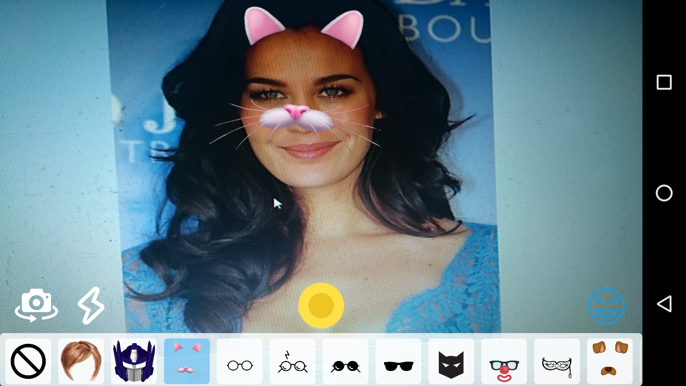

# Android: Face Filters

-   [License](#-license)

Snapchat and Instagram like Face Filters.

It is based on the following project:

https://github.com/googlesamples/android-vision/tree/master/visionSamples/FaceTracker

## 📜 License
This library is provided under the Apache License.
